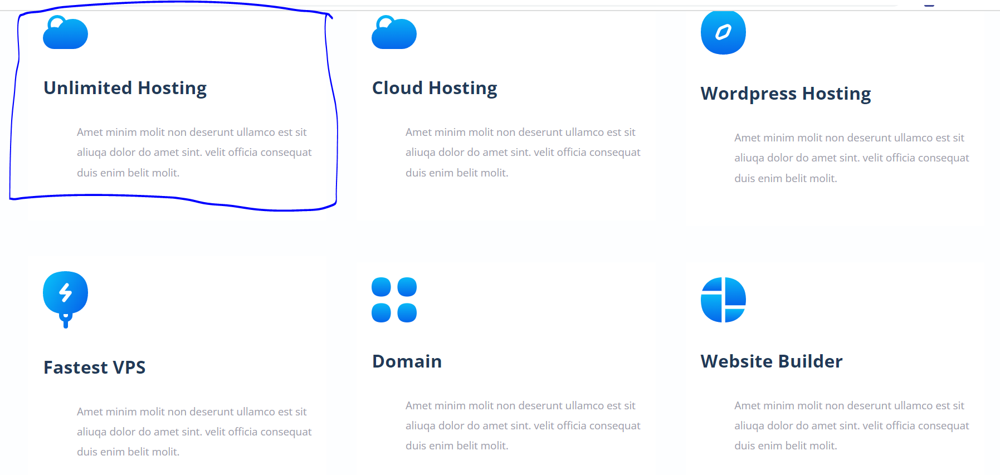
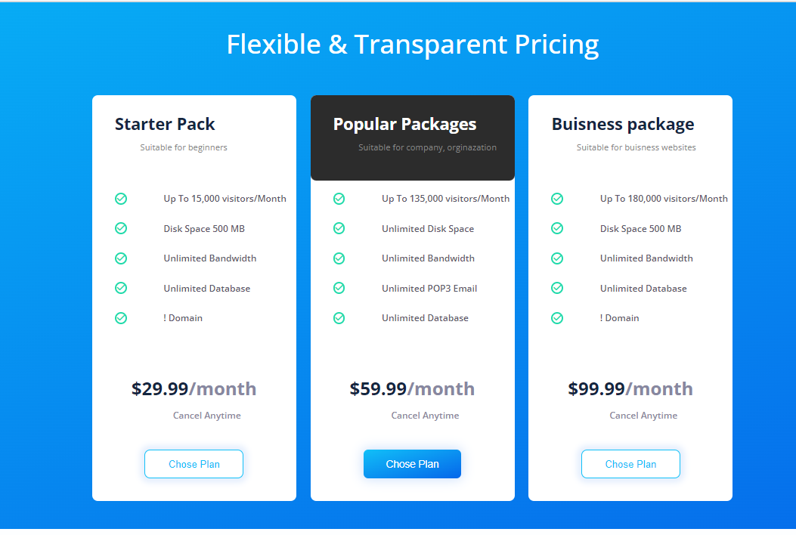
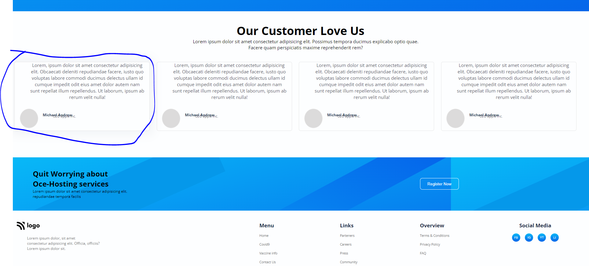
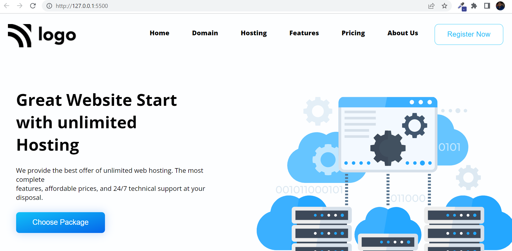

### Ultimate Webhosting Landing Page Project 11

#By Gaurav Shah

This sample web hosting web page is designed using HTML and CSS

Web page is divided in to sections

Let's walk through each part of the page

First Navbar is laid down with 20vh hieght, Logo is set on left, and menu items on right

Then comes the hero section, screen is divided in to two equal halfs
using hero left and here right
hero left holds the text contetns
hero right holds the image

Under the technical section this orders are just swept

Under the help section is replication of technical section

Each service card is designed and placed using flex box

Each price card is designed and placed using flex box, additional features are given to card in the center

Footer cards are designed and placed using flex box

Appeareance of the site looks like bellow

